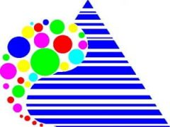
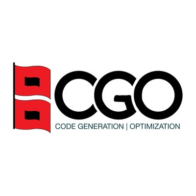

### Experience

<section>

    <h3 class="text">Graduate Researcher</h3>
    

     
    

        <h3 class="text">Graduate Researcher - <a href="https://lac-dcc.github.io/">Compilers Lab</a></h3>
        
<strong>Title:</strong> Automatic Generation of Benchmarks via Self-Similar Code
  
        
        
• Supervisor: <a href="https://dcc.ufmg.br/professor/fernando-magno-quintao-pereira/" style="color: blue">Fernando Magno Quintão Pereira</a>

    

  

    <h3 class="text">Works</h3>
    

    <h3 class="text">Jr. Linux Kernel Developer - <a href="https://magalu.cloud">MagaluCloud</a></h3>
    

    
      
    Start: Jun 2024 - End: Oct 2024

<h3 class="text">Mid-Level FullStack Developer - Sociedade Mineira de Cultura</h3>

I’ve been working in web software development for two years, using tools like Django, Python, React, Apache, and Nginx. I’m also experienced in DevOps, working with CI/CD, Gitlab, Bitbucket, Docker, Git, Jira, and Confluence. Additionally, I handle server maintenance and database administration for PostgreSQL and MySQL.

During the period I worked as a developer, I also obtained certifications in the DevOps field and had the opportunity to implement the practice of continuous integration and delivery in the software development process where I work, using the GitLab platform for test and build automation and leveraging Docker containerization system.

      
    Start: 2021 - End: 2024

 

  

    <h3 class="text">BSc projects</h3>
    

     
    

        <h3 class="text">Undergraduate final project - <a href="https://icei.pucminas.br">ICEI</a> - <a href="https://www.pucminas.br/destaques/">PUCMINAS</a></h3>
        
<strong>Title:</strong> Maximizing Efficiency in Inter-Process Communication: Exploring a Zero-Copy Abstraction
 
        
My undergraduate final project proposes a kernel-bypass device that implements a communication abstraction between processes using the zero-copy technique, involving direct data transfer between processes in a microkernel architecture, removing context switches and intermediate copies that cause overhead.
 
        
• Supervisor: <a href="https://www.microsoft.com/en-us/research/people/ppenna/" style="color: blue">Pedro Henrique Penna</a>

    

  

  

    <h3 class="text">Researcher in Compilers and Operating System at <a href="https://github.com/nanvix">Nanvix</a></h3>
    
Virtual Machine develop using C and C++ languanges. Nanvix VM decode a MIPS and ARM assembly, translate to RISC-V Assembly and run in a manycore processor!

    
As a researcher with expertise in Compilers and Operating Systems at Nanvix, my focus lies in
        the advancement of a virtual machine project. This undertaking centers on the development
        of a Just-In-Time translation engine within the Nanvix emulator’s operating system. Aiming
        to enhance emulation efficiency, my role encompasses the creation of this engine using
        C and C++ programming languages. Its primary function is the real-time translation of
        assembly instructions, transitioning from the MIPS architecture to the RISC-V processor, thus
        contributing to the optimization of the Nanvix emulator’s performance.

    
    
• Supervisor: <a href="https://www.microsoft.com/en-us/research/people/ppenna/" style="color: blue">Pedro Henrique Penna</a>

    
• Letter of Recomendation: <a href="./pdf/1732116641794.pdf" style="color: blue">link</a>

  

  

  

    <h3 class="text"><a href="https://www.gov.br/cnpq/pt-br">PIBIC/CNPQ</a> Researcher at Programa de Pós-Graduação em Odontologia - <a href="https://icbs.pucminas.br/">ICBS</a> - <a href="https://www.pucminas.br/destaques/">PUCMINAS</a></h3>
    
<strong>Title:</strong> Information and communication technology in dentistry: informative and educational approach for patients with fixed orthodontic appliances
 
    
I have worked as an Android application developer, using Java and Kotlin programming
      languages, as part of a scientific initiation for the postgraduate program in dentistry.

      
• Advisor: Rodrigo Villamarim Soares

      
• Document: <a href="./pdf/1732116419484.pdf" style="color: blue">link</a>

  

<h3 class="text">Teaching</h3>

    <h3 class="text">Compilers</h3>
    
Tutoring for the Compilers course at the Institute of Exact Sciences and Informatics - ICEI - PUCMINAS. As a mentor, I provide assistance to students of the course by addressing their questions and supporting the lead instructor

    
• Document: <a href="./pdf/1732116543494.pdf" style="color: blue" target="_blank">link</a>

    
     
    April 2021 - June 2021

    <h3 class="text">Algorithms and Data Structures II</h3>
    
Tutoring for the Algorithms and Data Structures II course at the Institute of Exact Sciences and Informatics - ICEI - PUCMINAS. As a mentor, I provide assistance to students of the course by addressing their questions and supporting the lead instructor.

    
• Document: <a href="./pdf/1732116568739.pdf" target="_blank" style="color: blue">link</a>

    
     
    October 2021 - January 2022

    <h3 class="text">Data Base</h3>
    
Tutoring for the Data Base course at the Institute of Exact Sciences and Informatics - ICEI - PUCMINAS. As a mentor, I provide assistance to students of the course by addressing their questions and supporting the lead instructor.

    
• Document: <a href="./pdf/1732116520652.pdf" target="_blank" style="color: blue">link</a>

    
     
    July 2020 - November 2020

  <h3 class="text">Volunteering</h3>
  

  

      <h3 class="text">Artifact Evaluator - PACT25</h3>
      
<i>International Conference on Parallel Architecture and Compilation Techniques</i>

   
  

         
    
• Letter of Recomendation: <a href="./pdf/1760583710438.pdf" style="color: blue">link</a>

  

  

  

      <h3 class="text">Artifact Evaluator - CGO26</h3>
      
<i>International Symposium on Code Generation and Optimization</i>

   
  

         
    
• Letter of Recomendation: <a href="./pdf/20260208-vinicius-da-silva-artifact-acknowledgement-letter.pdf" style="color: blue">link</a>

  

  

 

      <h3 class="text">Artifact Evaluator - CC26</h3>
      
<i>International Conference on Compiler Construction</i>

   
  

         
  
• Artifact Evaluation Committee: <a href="https://conf.researchr.org/committee/CC-2026/CC-2026-artifact-evaluation-committee" style="color: blue">link</a>

  

   

  

      <h3 class="text">Artifact Evaluator - PLDI26</h3>
      
<i>Conference on Programming Language Design and Implementation</i>

   
  

         
  
• Artifact Evaluation Committee: <a href="https://pldi26.sigplan.org/committee/pldi-2026-pldi-research-artifacts-artifact-evaluation-committee" style="color: blue">link</a>

  

