## Areas of Interest

---

* Compilers
* Code Optimization
* Formal Verification
* Virtualization and Containerization
* Operating Systems
* Programming Language Theory λ

---

## Current work

 
My master's research focuses on automatic generation of multi-language programs using L-systems. This research led to the development of <a href="https://benchgen.github.io/">BenchGen</a>, a multi-language benchmark generator based on L-systems. Currently, BenchGen generates programs in the following languages: C, C++, V, Zig, Julia, Odin, Go, and MLIR. For more information, please take a look at the <a href="https://arxiv.org/pdf/2512.17616">paper</a>.

I also conduct research in the area of memory allocation for Constant-Bounded Programs, implemented in the <a href="https://github.com/lac-dcc/Marid">Marid</a> project, a memory allocator for MLIR.

---

## Previous work

I hold a Bachelor’s degree in Computer Science from the Pontifical Catholic University of Minas Gerais (PUCMINAS), with over two years of research experience in compilers and operating systems. In the Nanvix OS project, I built a just-in-time translator from MIPS to RISC-V for a virtual machine. For my final project, I implemented a zero-copy interprocess communication library for microkernel systems.

During my studies, I was a teaching assistant for Databases, Algorithms and Data Structures II, and Compilers.

I worked as a Mid-Level Web Developer at Sociedade Mineira de Cultura and developed mobile applications for the PUCMINAS Dental Clinic, resulting in five registered software patents and as a Linux Kernel Developer at MagaluCloud, contributing to kernel-level and open-source infrastructure projects.

I was also a volunteer at <i>International Conference on Parallel Architectures and Compilation Techniques</i> (PACT25), <i>International Symposium on Code Generation and Optimization (CGO26) and (CGO27)</i>, <i>International Conference on Compiler Construction (CC26) and Conference on Programming Language Design and Implementation (PLDI26)</i> on the Artifact Evaluation Committee.

---

## Recent News

---

### CHIP-8 using Rust PL

<a href="https://www.linkedin.com/posts/viniciusfsilva_hi-guys-after-spending-the-last-two-years-activity-7500526152164290560-JYAi?utm_source=share&utm_medium=member_desktop&rcm=ACoAACSrPnkB6N0_TvgJ615gZ93lEQ8n_zD3p2Q">see post</a>

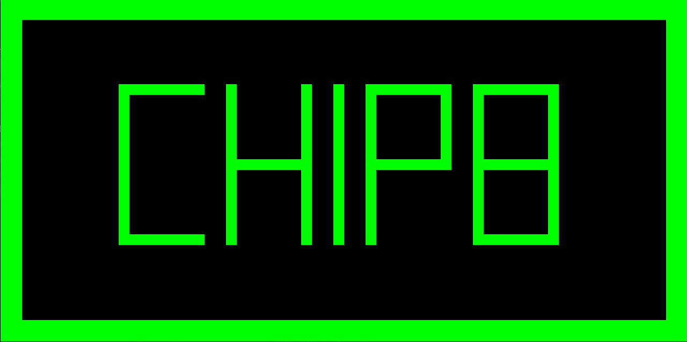

---

### Vinicius Silva successfully defended his MSc project, "Multi-Language Benchmark Generation via L-Systems," on August 28, 2026, before a committee consisting of Xinliang (David) Li (Google) and Björn Franke (The University of Edinburgh).

<a href="https://www.linkedin.com/posts/compilers-lab_vinicius-silva-successfully-defended-his-activity-7499178435840278528-X97h?utm_source=share&utm_medium=member_desktop&rcm=ACoAACSrPnkB6N0_TvgJ615gZ93lEQ8n_zD3p2Q">see post</a>

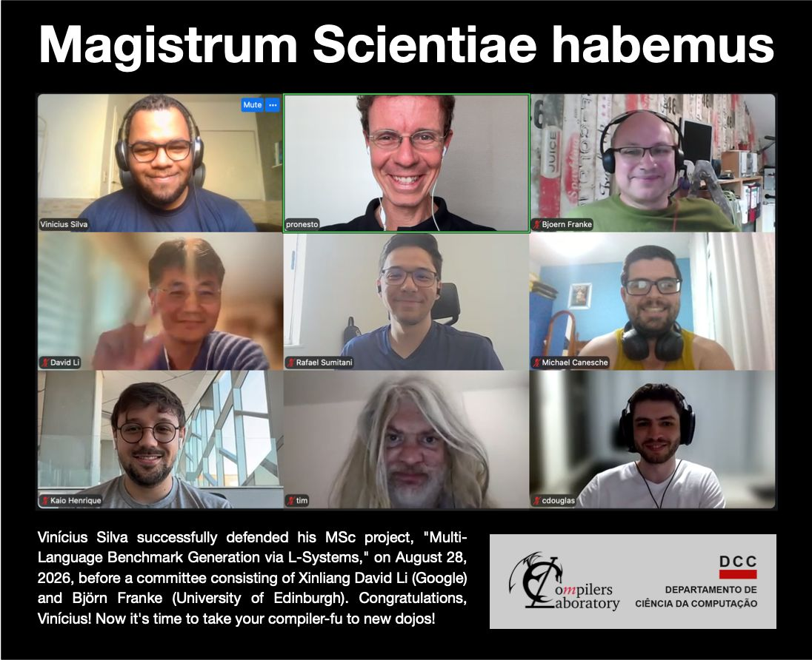

---

### Vinicius Silva will defend his Master's project, "Multi-Language Benchmark Generation via L-Systems", on August 28.

<a href="https://www.linkedin.com/posts/compilers-lab_research-academia-fractal-activity-7497726185020424192-5x6g?utm_source=share&utm_medium=member_desktop&rcm=ACoAACSrPnkB6N0_TvgJ615gZ93lEQ8n_zD3p2Q">see post</a>

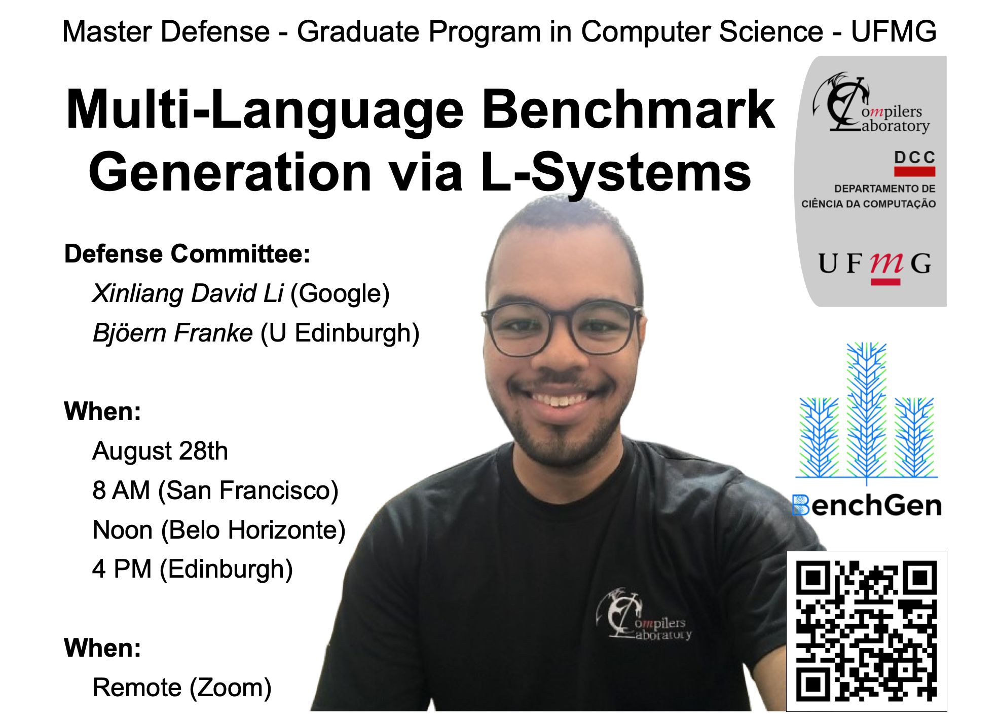

---

### The paper "Memory Allocation for Constant-Bounded Programs" [1] is publicly available on arXiv

<a href="https://www.linkedin.com/posts/epbf-research-innovation-share-7495539420209790978-Yvh6/?utm_source=share&utm_medium=member_desktop&rcm=ACoAACSrPnkB6N0_TvgJ615gZ93lEQ8n_zD3p2Q">see post</a>

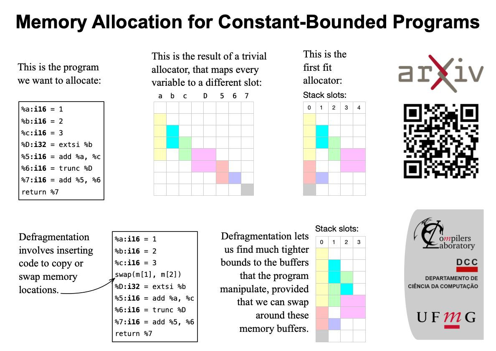

---

### The paper "Multi-Language Benchmark Generation via L-Systems" has been accepted for publication at the Brazilian Symposium on Programming Languages (SBLP 2026)

<a href="https://www.linkedin.com/posts/compilers-lab_programming-academia-research-activity-7484606591783202818-XPmg?utm_source=share&utm_medium=member_desktop&rcm=ACoAACSrPnkB6N0_TvgJ615gZ93lEQ8n_zD3p2Q">see post</a>

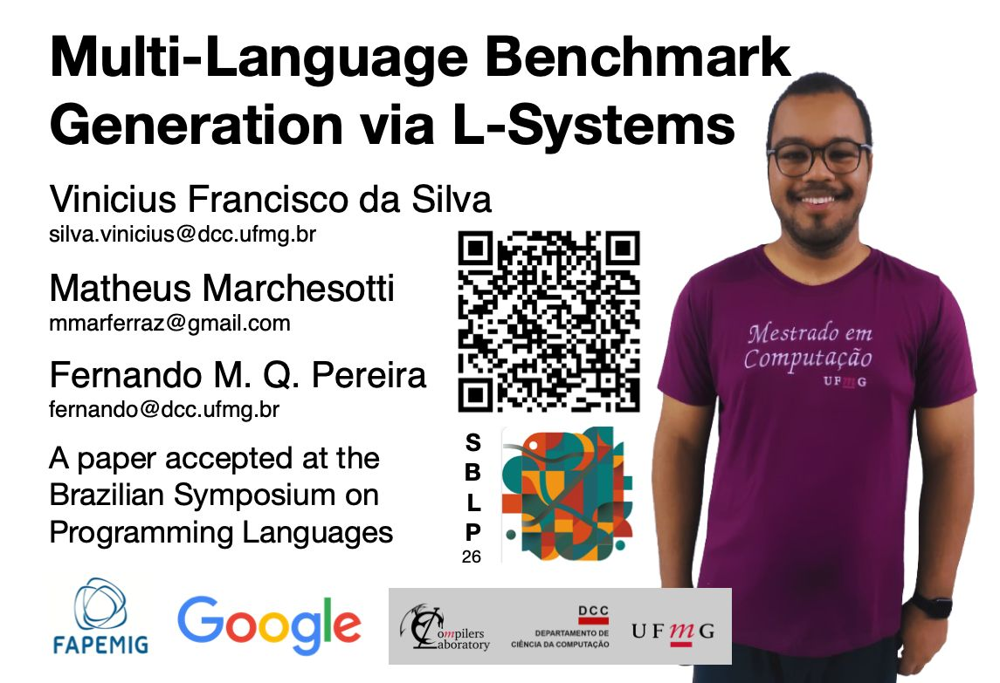

---

### BenchGen now Supports Pipefish.

<a href="https://www.linkedin.com/posts/compilers-lab_benchgen-now-supports-pipefish-this-is-activity-7475299060883591169-rlem?utm_source=share&utm_medium=member_desktop&rcm=ACoAACSrPnkB6N0_TvgJ615gZ93lEQ8n_zD3p2Q">see post</a>

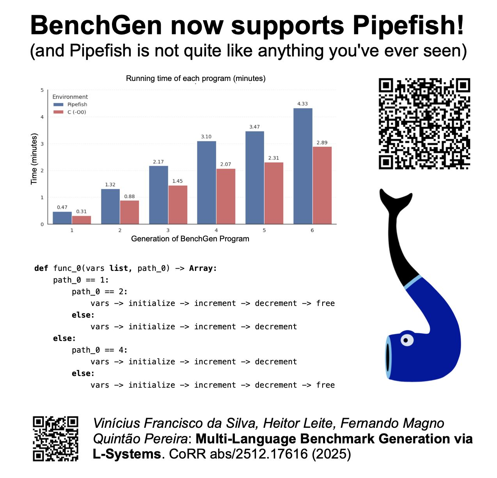

---

### BenchGen now Supports Nim Lang.

<a href="https://www.linkedin.com/posts/compilers-lab_matheus-marchesotti-has-added-nim-to-benchgen-activity-7460700213050023936-FtgV?utm_source=share&utm_medium=member_desktop&rcm=ACoAACSrPnkB6N0_TvgJ615gZ93lEQ8n_zD3p2Q">see post</a>

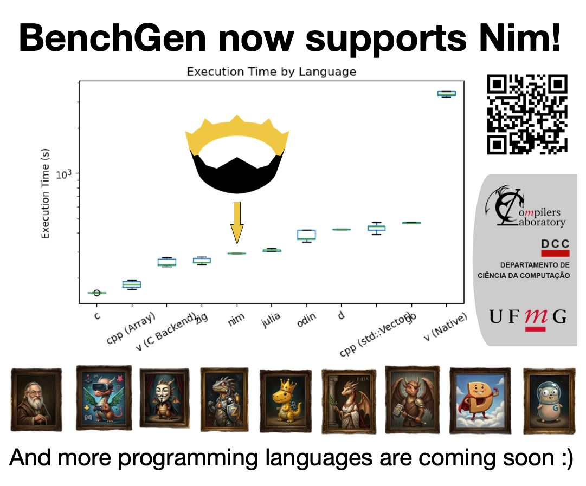

---

### BenchGen now Supports D Lang.

<a href="https://www.linkedin.com/posts/compilers-lab_matheus-marchesotti-has-added-support-to-activity-7457195429122695168-BpRW?utm_source=share&utm_medium=member_desktop&rcm=ACoAACSrPnkB6N0_TvgJ615gZ93lEQ8n_zD3p2Q">see post</a>

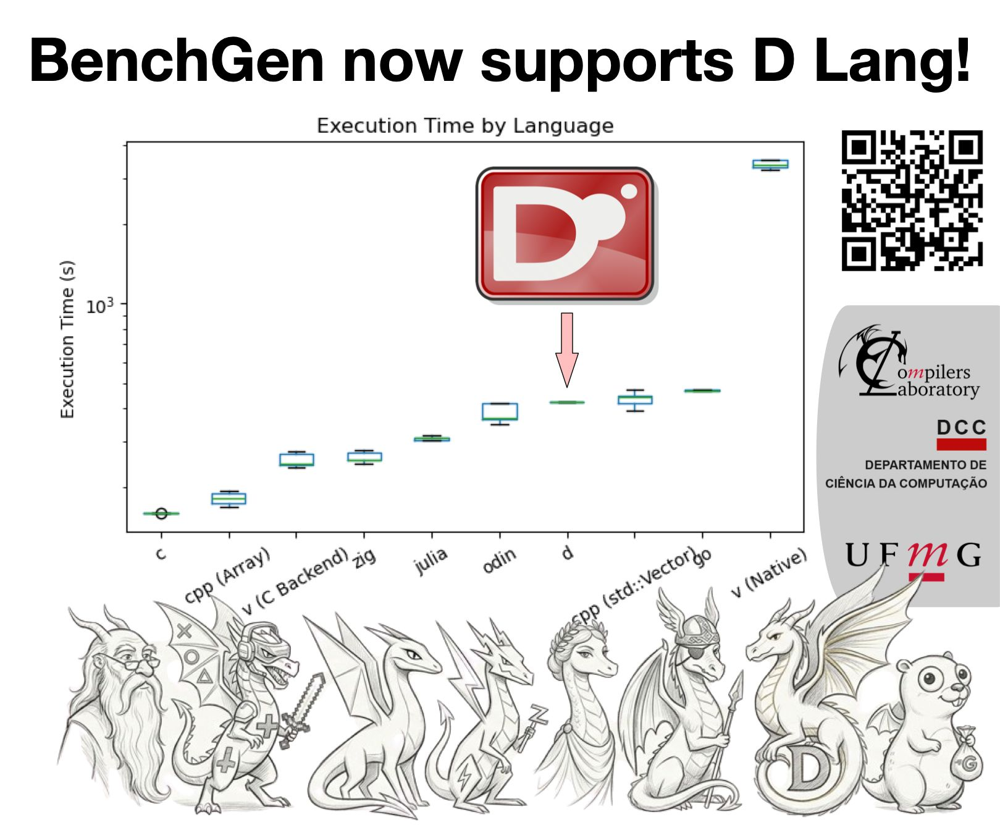

---

### Built a new language? Now give it a workout!.

<a href="https://www.linkedin.com/posts/testing-a-brand-new-language-is-tough-when-share-7453476046273839105-ktrX?utm_source=share&utm_medium=member_desktop&rcm=ACoAACSrPnkB6N0_TvgJ615gZ93lEQ8n_zD3p2Q">see post</a>

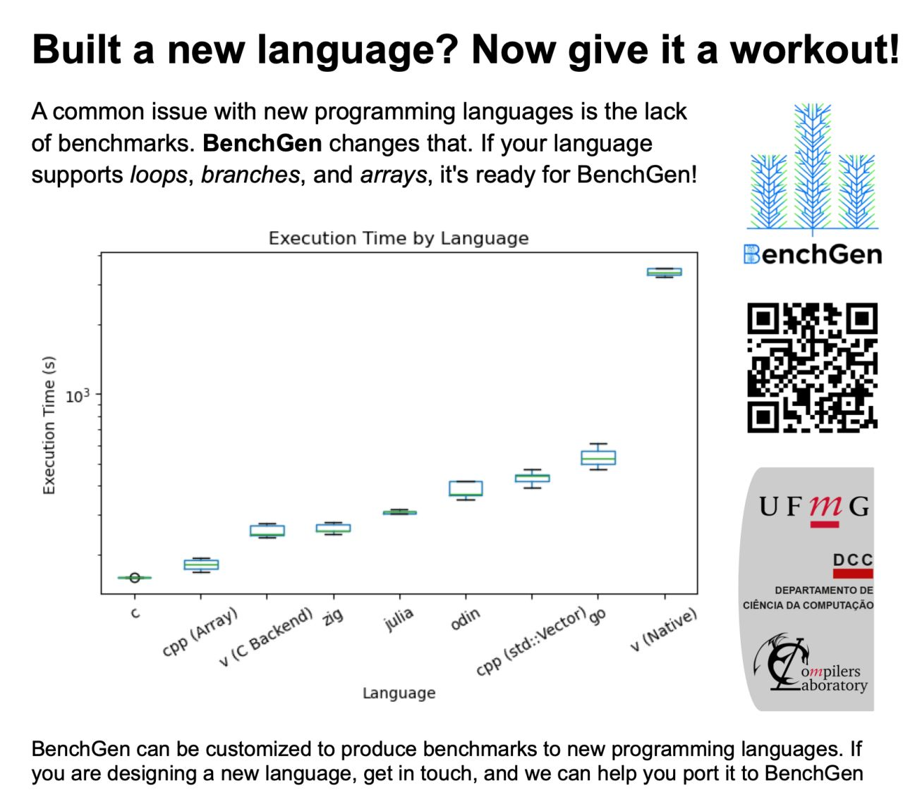

---

### First PR accepted in Carbon! Adding support for `integer-to-char` conversion.

<a href="https://www.linkedin.com/posts/compilers-lab_we-are-pleased-to-announce-that-a-pull-request-activity-7420086530687467520-lDcn?utm_source=share&utm_medium=member_desktop&rcm=ACoAACSrPnkB6N0_TvgJ615gZ93lEQ8n_zD3p2Q">see post</a>

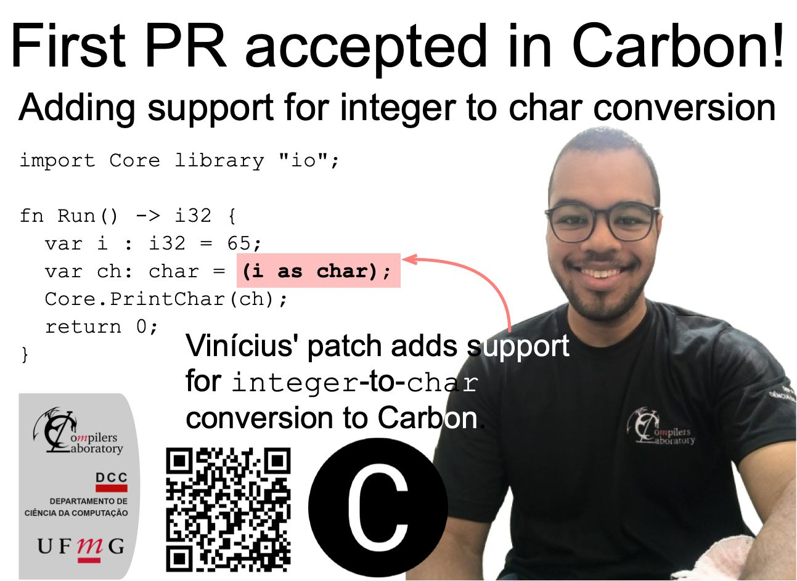

---

### Five students affiliated with UFMG’s Compilers Lab volunteered to serve as artifact evaluators for the International Conference on Compiler Construction (CC 2026)

<a href="https://www.linkedin.com/posts/compilers-lab_this-year-five-students-affiliated-with-activity-7411032911581282304-eOtn?utm_source=share&utm_medium=member_desktop&rcm=ACoAACSrPnkB6N0_TvgJ615gZ93lEQ8n_zD3p2Q">see post</a>

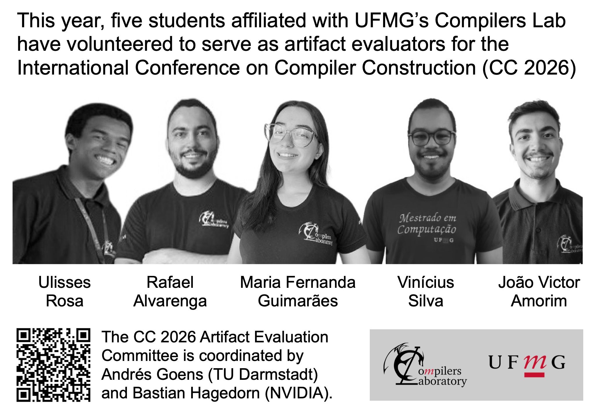

---

### The paper "Multi-Language Benchmark Generation via L-Systems" is available in arXiv!

<a href="https://www.linkedin.com/posts/compilers-lab_research-compiler-academia-activity-7408838161784684545-87Pd?utm_source=share&utm_medium=member_desktop&rcm=ACoAACSrPnkB6N0_TvgJ615gZ93lEQ8n_zD3p2Q">see post</a>

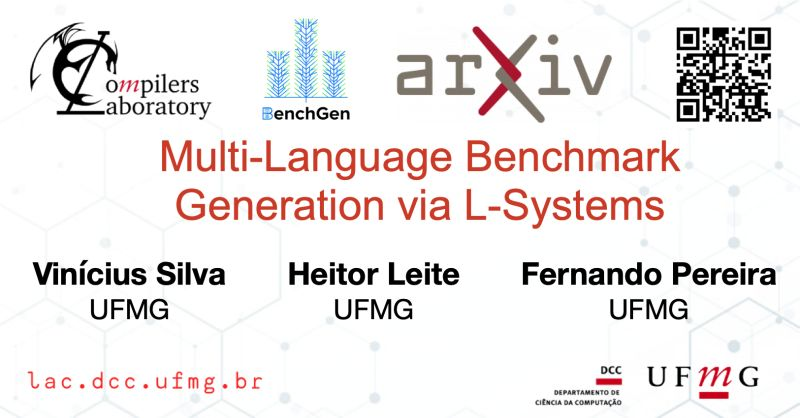

---

### BenchGen now supports Odin and Zig benchmarks!

<a href="https://www.linkedin.com/posts/compilers-lab_research-academia-compiler-activity-7401598328016347136-FtpB?utm_source=share&utm_medium=member_desktop&rcm=ACoAACSrPnkB6N0_TvgJ615gZ93lEQ8n_zD3p2Q">see post</a>

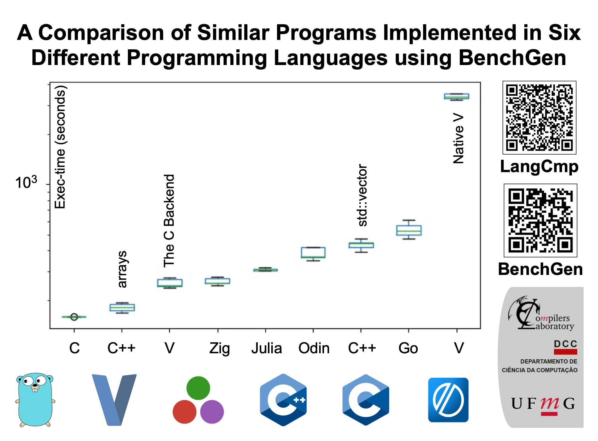

---

### BenchGen, our fractal-based program generator, now supports V!

<a href="https://www.linkedin.com/feed/update/urn:li:activity:7394012884726333441/?utm_source=share&utm_medium=member_desktop&rcm=ACoAACSrPnkB6N0_TvgJ615gZ93lEQ8n_zD3p2Q">see post</a>

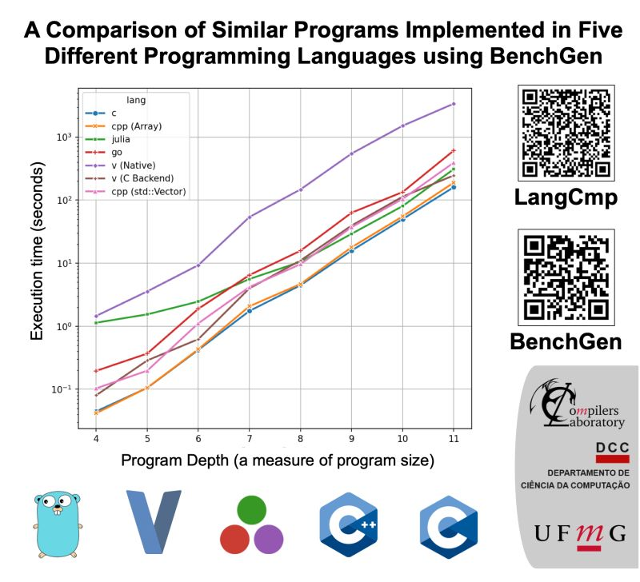

---

### The Impact of Profile Guided Optimizations

<a href="https://www.linkedin.com/posts/compilers-lab_compiler-research-programming-activity-7384698030937165825-4NQa?utm_source=share&utm_medium=member_desktop&rcm=ACoAACSrPnkB6N0_TvgJ615gZ93lEQ8n_zD3p2Q">see post</a>

---

### Request for Feedback

<a href="https://www.linkedin.com/posts/compilers-lab_vinicius-silva-viniciusilvaieeeorg-and-activity-7379876088342020096-2v-f?utm_source=share&utm_medium=member_desktop&rcm=ACoAACSrPnkB6N0_TvgJ615gZ93lEQ8n_zD3p2Q">see post</a>

---

### A comparison of different programming languages using BenchGen

<a href="https://www.linkedin.com/posts/compilers-lab_compiler-programming-fractal-activity-7373684878262841344-Axz7?utm_source=share&utm_medium=member_desktop&rcm=ACoAACSrPnkB6N0_TvgJ615gZ93lEQ8n_zD3p2Q">see post</a>

---

### Relationship between compilation time and execution time using BenchGen

<a href="https://www.linkedin.com/posts/compilers-lab_compilers-programming-education-activity-7349350324861595649-lNqh?utm_source=share&utm_medium=member_desktop&rcm=ACoAACSrPnkB6N0_TvgJ615gZ93lEQ8n_zD3p2Q">see post</a>

---

### BenchGen technical report

<a href="https://www.linkedin.com/posts/compilers-lab_programming-compiler-fractal-activity-7339717382224973825-nQEp?utm_source=share&utm_medium=member_desktop&rcm=ACoAACSrPnkB6N0_TvgJ615gZ93lEQ8n_zD3p2Q">see post</a>

---

### An evolution of GCC across different versions

<a href="https://www.linkedin.com/posts/compilers-lab_if-you-compare-gcc-5-april-2015-to-gcc-activity-7336481822442205184-gVx3?utm_source=share&utm_medium=member_desktop&rcm=ACoAACSrPnkB6N0_TvgJ615gZ93lEQ8n_zD3p2Q">see post</a>

---

### BenchGen: Fractal-Based Program Generator

<a href="https://www.linkedin.com/posts/compilers-lab_benchgen-is-a-benchmark-generator-that-uses-activity-7332796843174588417-sqqA?utm_source=share&utm_medium=member_desktop&rcm=ACoAACSrPnkB6N0_TvgJ615gZ93lEQ8n_zD3p2Q">see post</a>

---

### Comparison of different optimization levels in GCC

<a href="https://www.linkedin.com/posts/compilers-lab_theory-programming-compiler-activity-7326285792224456704-szta?utm_source=share&utm_medium=member_desktop&rcm=ACoAACSrPnkB6N0_TvgJ615gZ93lEQ8n_zD3p2Q">see post</a>

---

### Clang and GCC comparison using BenchGen

<a href="https://www.linkedin.com/posts/compilers-lab_compilers-clang-gcc-activity-7310325694117388288-QPYp?utm_source=share&utm_medium=member_desktop&rcm=ACoAACSrPnkB6N0_TvgJ615gZ93lEQ8n_zD3p2Q">see post</a>

---

### BenchGen - An C Benchmark Generator via L-Systems

<a href="https://www.linkedin.com/posts/compilers-lab_breaking-news-students-from-ufmgs-compilers-activity-7255264752136798208-kdTH?utm_source=share&utm_medium=member_desktop&rcm=ACoAACSrPnkB6N0_TvgJ615gZ93lEQ8n_zD3p2Q">see post</a>

---

---

### r/ProgrammingLanguages

<a href="https://www.reddit.com/r/ProgrammingLanguages/comments/1nil3we/benchgen_a_multilanguage_benchmark_generator_via/?utm_source=share&utm_medium=web3x&utm_name=web3xcss&utm_term=1&utm_content=share_button">see post</a>

---

### r/Julia

<a href="https://www.reddit.com/r/Julia/comments/1njqp4k/a_benchmark_generator_to_compare_the_performance/?utm_source=share&utm_medium=web3x&utm_name=web3xcss&utm_term=1&utm_content=share_button">see post</a>

---

### r/Compilers

<a href="https://www.reddit.com/r/Compilers/comments/1o96bb7/the_impact_of_profile_guided_optimizations/?utm_source=share&utm_medium=web3x&utm_name=web3xcss&utm_term=1&utm_content=share_button">see post</a>

<a href="https://www.reddit.com/r/Compilers/comments/1l542yk/benchgen_a_fractalbased_program_generator/?utm_source=share&utm_medium=web3x&utm_name=web3xcss&utm_term=1&utm_content=share_button">see post</a>

<a href="https://www.reddit.com/r/Compilers/comments/1njjiqk/a_benchmark_generator_to_compare_the_performance/?utm_source=share&utm_medium=web3x&utm_name=web3xcss&utm_term=1&utm_content=share_button">see post</a>

---
